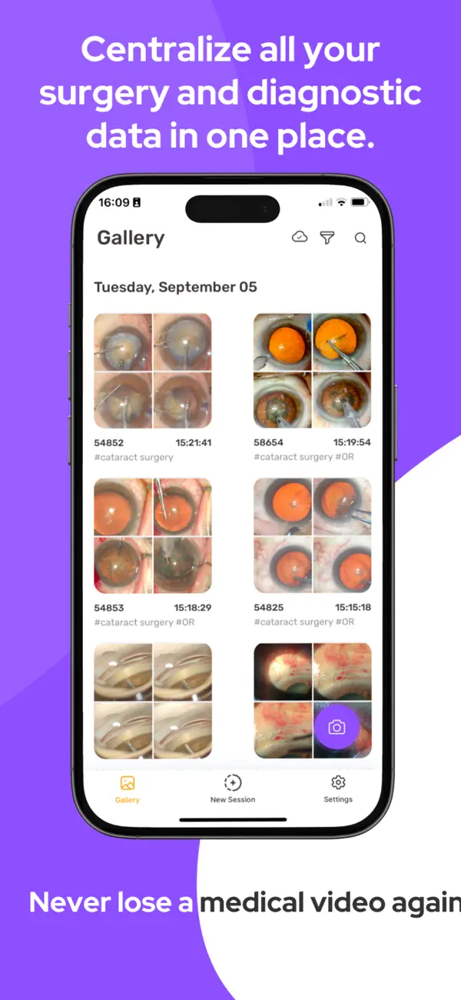
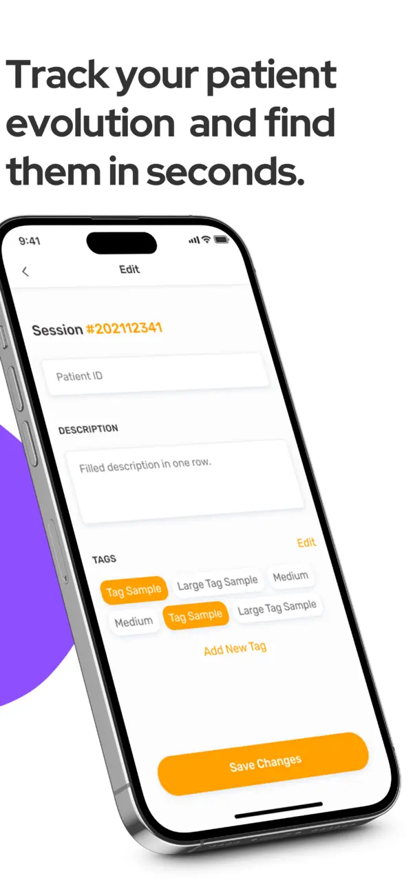
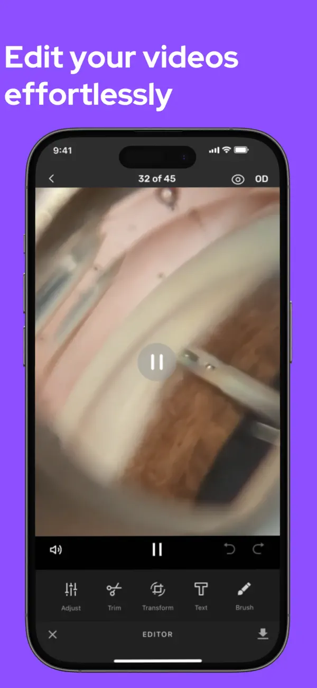
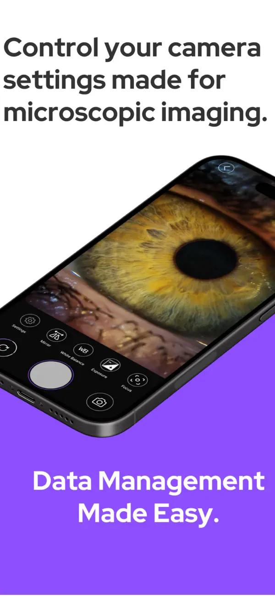
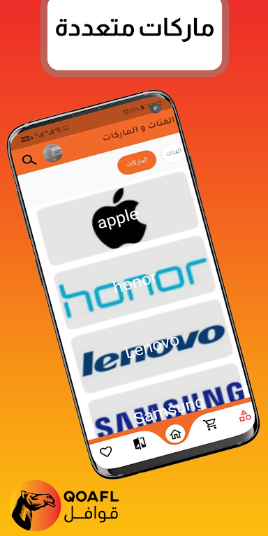
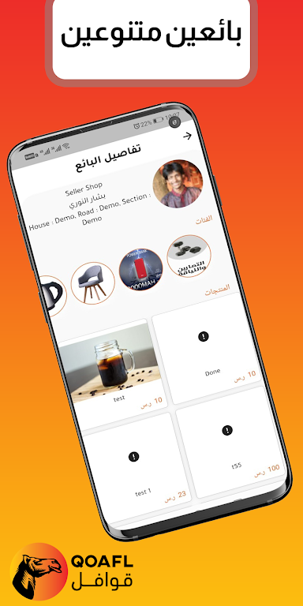
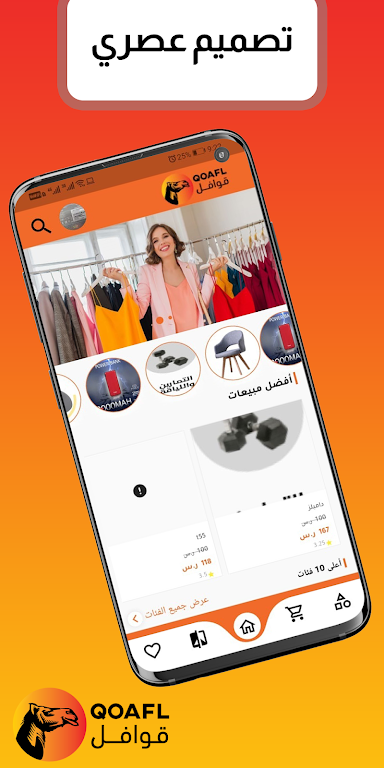
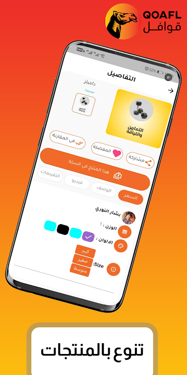
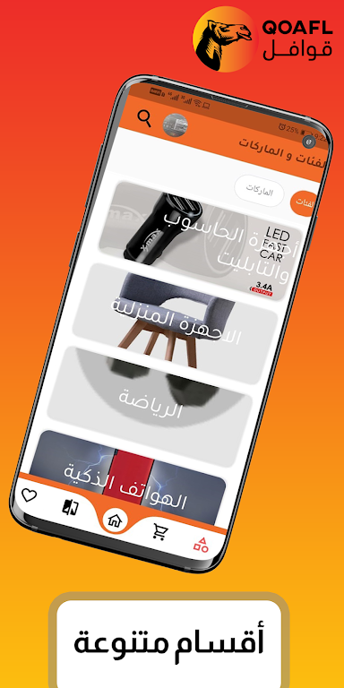
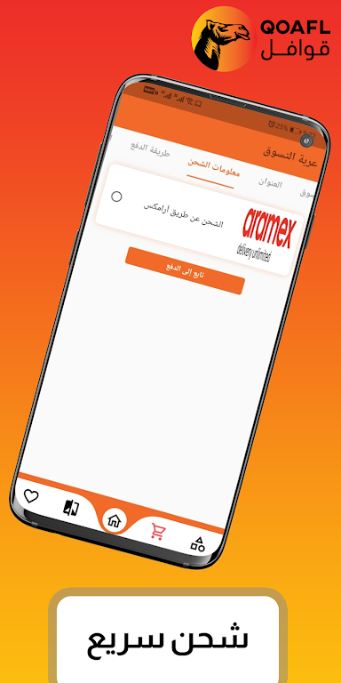

# Mostafa ALZOUBI 

## About Me
Seasoned Mobile Developer with extensive experience exceeding 5.5 years, adept at delivering solutions across global teams and client engagements, and ready for new opportunities.

## Apps

### MicroREC
---

    

- **Description**: MicroRec is a specialized app designed for professionals in ophthalmology, endodontics, ENT, neurosurgery, and microscopy. It offers advanced data management for microscopic images and videos, including session organization, cloud storage, and video editing features like contrast adjustment and trimming. The app also includes tailored camera functionalities for precise image and video capture in clinical settings.
- **Technologies Used**: 

### Memo Nas
---

    
- **Description**: Memo Nas is a real-time chat application developed with messaging, audio, and video call functionalities, offering a comprehensive communication experience similar to popular messaging apps.
- **Technologies Used**: 

### Gamer VPN
---

   
- **Description**: Free lightweight VPN application.
- **Technologies Used**: 

### Alnader Store
---

   
- **Description**: E-commerce application for electronic devices in KSA, integrating multiple shipping and payment methods for enhanced user convenience
- **Technologies Used**: 

### Qoafl 
---

     
- **Description**: An E-Commerce Application offering various products, shipment methods, and electronic payment options.
- **Technologies Used**: 

### BazarCom 
---

- **Description**: Marketplace application for buying and selling in Syria.
- **Technologies Used**: 

### City Tale 
---
     
- **Description**: Tourist application for Italy, suggesting trips based on budget and time constraints.
- **Technologies Used**: 

### Algenie
---

- **Description**: An ordering application for food & drinks from restaurants and markets.
- **Technologies Used**: 

### Zaha 
---

- **Description**: An advertisement application showcasing construction companies' services and products.
- **Technologies Used**: 

### Levant 
---

- **Description**: An application displaying Levant's products with details and prices.
- **Technologies Used**: 

### Phenecia 
---

- **Description**: An application for tracking shipments within Syria and globally.
- **Technologies Used**: 

## Skills

- **Proficient**:
  
  
  
  
  
  
  
  
  
  
  
  
  
  
  
  
  
  
  
  
  
  
  
  
  
  
  
  

- **Familiar**:
  
  
  
  

## Education
**Damascus University** — Bachelor in Computer Engineering
**Sep 2012 - Jul 2019**

## Languages
- **English**: B1
- **German**: A2

## Contact
- **Email**: [mostafaalzoubi1994@gmail.com](mailto:mostafaalzoubi1994@gmail.com)
- **LinkedIn**: [Mostafa ALZOUBI](https://www.linkedin.com/in/Mostafa-ALZOUBI/)
- **GitHub**: [MostafaALZOUBI1994](https://github.com/MostafaALZOUBI1994)

